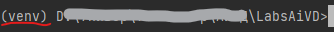
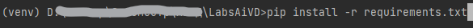

# Finance data analysis and visualization

Проект для анализа и визуализации данных ETF с помощью библиотек Pandas, Numpy, Matplotlib и Seaborn.

##Инструкция по установке

### Требования к системе
- Python версии 3.8 и выше

### Подготовка системы

Для запуска лабораторных работ необходимо открыть папку с лабораторными через терминал или открыть папку с лабораторными работами с помощью IDE (например, VSCode).

Необходимо проверить наличие установщика python пакетов pip с помощью следующей команды:
```
pip --version
```

Далее необходимо создать виртуальное окружение (в папке проекта!) с помощью следующей команды:
```
python -m venv venv
или
python3 -m venv venv
```

В папке проекта должна появиться папка venv.
Для установки необходимых библиотек необходимо активировать виртуальное окружение.
Чтобы активировать виртуальное окружение, необходимо ввести в терминале в папке проекта следующую команду:
```
Для Windows:
Путь\к\папке\проекта>venv\Scripts\activate

Для Linux:
Путь\к\папке\проекта>source venv\bin\activate
```

После выполнения команды окно терминала должно выглядеть следующим образом:



Установка пакетов с помощью pip:



Для запуска программы необходимо в папке проекта (в терминале) выполнить следующую команду:
```
python main.py
``` 

Или запустить файл через IDE (например, VS Code)

--------------------

This project uses python libraries (Numpy, Pandas, Matplotlib, Seaborn) to prepare, analyse and create a visual implementation of financial data.

The scope of this project includes:

- Data preparation
- Data analysis: 
  - Correlation analysis
  - Trend analysis
  - Volatility analysis
- Data visualization